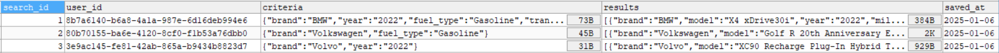
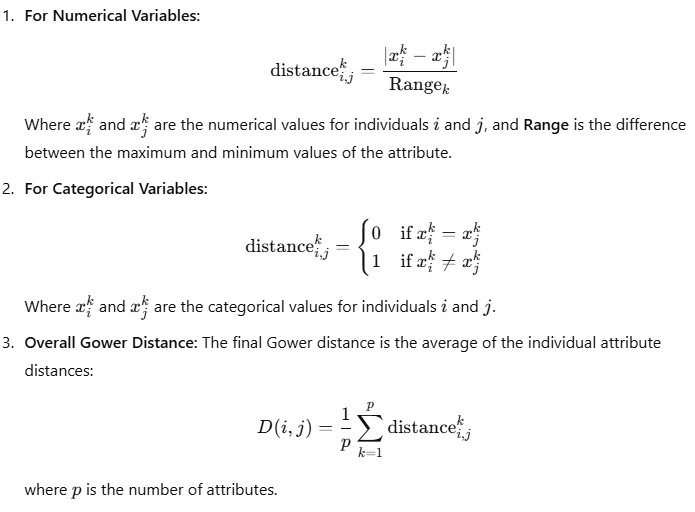

# Car Price Prediction App

A Clojure command-line application for searching, estimating, and predicting used car prices using both a static dataset for fast operations and real-time Marketcheck API data for enhanced precision and reliability. This app combines data analysis, regression techniques, and external data to provide accurate car price estimates and predictions.

This app is designed for anyone interested in buying or selling used cars, car enthusiasts, and analysts who want to understand and predict car market trends. Whether you are a car buyer looking for fair prices, a seller wanting to time your sale optimally, or a researcher analyzing car data, this app provides features to explore car listings, estimate current values, and predict future prices.

## Installation

This project was created using Leiningen, therefore application can be executed from the command line by following the steps described below.

Clone the repository:

```
git clone https://github.com/vsonja/car-price-prediction.git
```

Install project dependencies:

```
lein deps
```

You will need an API key from Marketcheck to fetch data and perform market-based predictions. Create a configuration file and add your API key:

```
(def api-key "MARKETCHECK_API_KEY")
```

Run the application:

```
lein run
```

The app uses MySQL to store saved searches by user ID. If you're using a local MySQL setup like XAMPP, make sure the MySQL module is running. You may need to create a database and relevant tables if they’re not already set up.

## User Stories

- As a user, I want to view all available cars so that I can explore my options.

- As a user, I want to search for specific car models so that I can find cars that meet my preferences.

- As a user, I want to save my search criteria so that I can easily access them later without re-entering details.

- As a user, I want to open my saved searches so that I can quickly review previous results.

- As a user, I want to estimate the current market price of a car so that I can make an informed buying or selling decision.

- As a user, I want to predict the price of a car for the upcoming months so that I can decide the best time to buy or sell a car.

## Usage

This section demonstrates how to interact with the application, including sample input/output for each core feature. After starting the app in terminal, the following menu is presented:

```
Welcome to the Car Price Prediction App!

Menu Options:
1. View all available cars
2. Search for a specific car
3. Open saved searches
4. Estimate current price
5. Predict prices for the upcoming months
6. Exit

Select an option: 
```

### 1. View All Available Cars

Lists all cars from the dataset in tabular form.

```
Displaying all cars...
 
|        :brand |                                                  :model | :year |  :price | :mileage |
|---------------+---------------------------------------------------------+-------+---------+----------|
|          Ford |                         Utility Police Interceptor Base |  2013 |   10300 |    51000 |
|       Hyundai |                                            Palisade SEL |  2021 |   38005 |    34742 |
|         Lexus |                                           RX 350 RX 350 |  2022 |   54598 |    22372 |
|      INFINITI |                                        Q50 Hybrid Sport |  2015 |   15500 |    88900 |
|          Audi |                               Q3 45 S line Premium Plus |  2021 |   34999 |     9835 |
|           BMW |                                                   740iL |  2001 |    7300 |   242000 |
|         Lexus |                                          RC 350 F Sport |  2021 |   41927 |    23436 |
|         Aston |                                 Martin DBS Superleggera |  2019 |  184606 |    22770 |
|        Toyota |                                       Supra 3.0 Premium |  2021 |   53500 |    12500 |
|       Lincoln |                                     Aviator Reserve AWD |  2022 |   62000 |    18196 |
```

### 2. Search for a Specific Car

Filter cars based on user input.

```
Enter value for 'brand' (or press Enter to skip): Lexus
Enter value for 'model' (or press Enter to skip): 
Enter value for 'year' (or press Enter to skip): 2022
Enter value for 'mileage' (or press Enter to skip): 
Enter value for 'fuel_type' (or press Enter to skip): Gasoline 
Enter value for 'engine' (or press Enter to skip): 
Enter value for 'transmission' (or press Enter to skip): 
 
Results matching search criteria:

| :brand |                         :model | :year | :mileage | :fuel_type | :engine | :transmission | :price |
|--------+--------------------------------+-------+----------+------------+---------+---------------+--------|
|  Lexus |                  RX 350 RX 350 |  2022 |    22372 |   Gasoline |     3.5 |     Automatic |  54598 |
|  Lexus |                    LC 500 Base |  2022 |     2071 |   Gasoline |     5.0 |     Automatic |  99950 |
|  Lexus | RX 350 RX 350 F SPORT Handling |  2022 |    14330 |   Gasoline |     3.5 |     Automatic |  54998 |
|  Lexus |                 GX 460 Premium |  2022 |    35700 |   Gasoline |     4.6 |     Automatic |  51900 |
|  Lexus | RX 350 RX 350 F SPORT Handling |  2022 |    11238 |   Gasoline |     3.5 |     Automatic |  54798 |
|  Lexus |                    LC 500 Base |  2022 |     6875 |   Gasoline |     5.0 |     Automatic |  89000 |

Would you like to calculate average price? (Yes/No) Yes
Average price: 67540,67

Do you want to save this search? (Yes/No)
Your search has been saved!
```

### 3. Open Saved Searches

Retrieve searches saved to the MySQL database using generated user ID saved in user-id.txt file.

```
{:brand "Lexus", :year 2022, :fuel_type "Gasoline"}
 
| :brand |                         :model | :year | :mileage | :fuel_type | :engine | :transmission | :price |
|--------+--------------------------------+-------+----------+------------+---------+---------------+--------|
|  Lexus |                  RX 350 RX 350 |  2022 |    22372 |   Gasoline |     3.5 |     Automatic |  54598 |
|  Lexus |                    LC 500 Base |  2022 |     2071 |   Gasoline |     5.0 |     Automatic |  99950 |
|  Lexus | RX 350 RX 350 F SPORT Handling |  2022 |    14330 |   Gasoline |     3.5 |     Automatic |  54998 |
|  Lexus |                 GX 460 Premium |  2022 |    35700 |   Gasoline |     4.6 |     Automatic |  51900 |
|  Lexus | RX 350 RX 350 F SPORT Handling |  2022 |    11238 |   Gasoline |     3.5 |     Automatic |  54798 |
|  Lexus |                    LC 500 Base |  2022 |     6875 |   Gasoline |     5.0 |     Automatic |  89000 |
 
{:brand "Volkswagen", :year "2020"}
 
|     :brand |                         :model | :year | :mileage | :fuel_type |                                      :engine |     :transmission | :price |
|------------+--------------------------------+-------+----------+------------+----------------------------------------------+-------------------+--------|
| Volkswagen | Arteon 2.0T SEL Premium R-Line |  2020 |    26870 |   Gasoline |                   2.0L I4 16V GDI DOHC Turbo | 8-Speed Automatic |  34645 |
| Volkswagen |         Arteon 2.0T SEL R-Line |  2020 |    15500 |   Gasoline | 268.0HP 2.0L 4 Cylinder Engine Gasoline Fuel |       8-Speed A/T |  30000 |
| Volkswagen |                 Passat 2.0T SE |  2020 |    49400 |   Gasoline | 174.0HP 2.0L 4 Cylinder Engine Gasoline Fuel |       6-Speed A/T |  20900 |

{:brand "BMW", :year "2024", :transmission "A/T"}

| :brand |       :model | :year | :mileage | :fuel_type |                                               :engine | :transmission | :price |
|--------+--------------+-------+----------+------------+-------------------------------------------------------+---------------+--------|
|    BMW | 840 i xDrive |  2024 |     1500 |   Gasoline | 335.0HP 3.0L Straight 6 Cylinder Engine Gasoline Fuel |           A/T |  90000 |
```


### 4. Estimate Current Price

Estimates the current price using kNN regression.

The following sample output shows the selected value of k, a test input example, and the predicted price:

```
k = 2
{:brand Chevrolet, :model Traverse Premier, :year 2020, :mileage 52000, :fuel_type Gasoline, :engine 3.6, :transmission Automatic, :price 35800}
Predicted price: 35763.0
```        

### 5. Predict Prices for the Upcoming Months

Predicts future prices using historical data and linear regression.

```
Enter value for 'make': Toyota
Enter value for 'model': Camry
Enter value for 'year': 2024
Enter value for 'n-months': 6

Predicted prices over the next 6 months for Toyota Camry (2024):
{:month 2025-08, :predicted-price 26911,84}
{:month 2025-09, :predicted-price 26431,09}
{:month 2025-10, :predicted-price 25950,34}
{:month 2025-11, :predicted-price 25469,59}
{:month 2025-12, :predicted-price 24988,84}
{:month 2026-01, :predicted-price 24508,09}
```

## Implementation Overview

### Phase 1: CSV dataset

Used dataset is a comprehensive collection of automotive information extracted from the popular automotive marketplace website, https://www.cars.com. This dataset comprises 3770 data points, each representing a unique car listing, and includes eight distinct features: brand, model, year, mileage, fuel_type, engine, transmission and price.

Initial functionality is built on this static CSV dataset to enable the following actions: view all cars in the dataset, search cars by user criteria, save and open searches, estimate current price.

- User can browse the entire dataset or subsets offline with the view-all functionality.

- The app filters dataset by make, model, year, mileage, fuel type, engine and transmission to enable quick searches.

- Searches are persisted by `user-id` (generated as a UUID) in MySQL database, allowing reuse and management of past queries.

    

- Current price estimation is implemented in two ways:
    - Comparative Value Method with Weighted Average provides a simple and intuitive way to estimate price by averaging prices of similar car, giving more weight to closer matches.
    - To improve accuracy and better model relationships between car features and prices, k-Nearest Neighbors (kNN) regression was implemented manually to predict price based on the `k` most similar cars. By using Gower's distance as similarity metric, kNN effectively handles mixed data types (numerical and categorical). The dissimilarity is calculated as follows for all types of features in a dataset:
    
        

        To choose the best number of neighbors `k`, the Elbow Method is applied. Function `elbow-method` plots the performance metric MAE (Mean Absolute Error) against `k` and returns optimal value.

        To evaluate the accuracy of the manually implemented k-NN regression model, the dataset was split into training and testing subsets (80/20 split).

This phase ensures quick testing, avoids API limits, and gives users a responsive experience. Due to limited API calls, these features still rely on the CSV dataset. However, API-based implementations of these features also exist and are used selectively where needed (for example, in price predictions and VIN-based queries).

### Phase 2: Real-Time Market Data via Marketcheck API

To make future price prediction more accurate, the app fetches live market data. The History API is the only Marketcheck endpoint that provides historical price data, but it works only with VIN (Vehicle Identification Number), not parameters like make, model, or year. Therefore, to build a monthly price series for a specific type of car, the app first needs to gather relevant VINs.

That’s why the following workflow is implemented:

- Using Search API, function `fetch-vins-from-search` fetches distinct VINs for the given make, model, and year.

- For each VIN, History API retrieves past listings with dates and prices. MarketCheck History API gives many similar entries because it's tracking the same car listed on different sites. To get meaningful monthly price trends, it was essential to iterate through pages. If there are more than 50 historical listings then `page` parameter can be used to iterate over them. Only odd pages were fetched to reduce API calls and avoid hitting rate limits.

- The app summarizes historical prices to form a monthly price series. Specifically, it groups the historical prices by months and calculates a representative price for each month by averaging all prices recorded during that period. This process transforms raw listing data into a clean, ordered time series of monthly prices that reflect how the car’s market value changes over time.

Linear regression is applied on the monthly price series to predict future prices (for example, 3 months ahead). Once the monthly price series is constructed, the app uses linear regression to model the trend of price changes over time. Linear regression fits a straight line to the historical monthly prices, estimating a relationship between time (in months) and price. This model captures the general direction and rate of price changes - depreciation, appreciation, or stability. Using the fitted regression line, the app can extrapolate prices into the future by extending the line beyond the latest available data point. For example, it can predict the estimated price 3 months from the current month by plugging the future month index into the regression equation. This approach provides a simple yet effective way to forecast future car prices based on observed historical trends.

While the initial dataset works well for fast prototyping, it lacks time-based price changes. For real future prediction, time-series data (monthly price changes) and real listings from multiple sources are neccessary. Marketcheck API provides this, though it's used selectively to avoid exceeding the API's rate limits. This hybrid approach balances performance and accuracy while minimizing external API usage for high-cost operations.

## License

Copyright © 2024 FIXME

This program and the accompanying materials are made available under the
terms of the Eclipse Public License 2.0 which is available at
http://www.eclipse.org/legal/epl-2.0.

This Source Code may also be made available under the following Secondary
Licenses when the conditions for such availability set forth in the Eclipse
Public License, v. 2.0 are satisfied: GNU General Public License as published by
the Free Software Foundation, either version 2 of the License, or (at your
option) any later version, with the GNU Classpath Exception which is available
at https://www.gnu.org/software/classpath/license.html.
